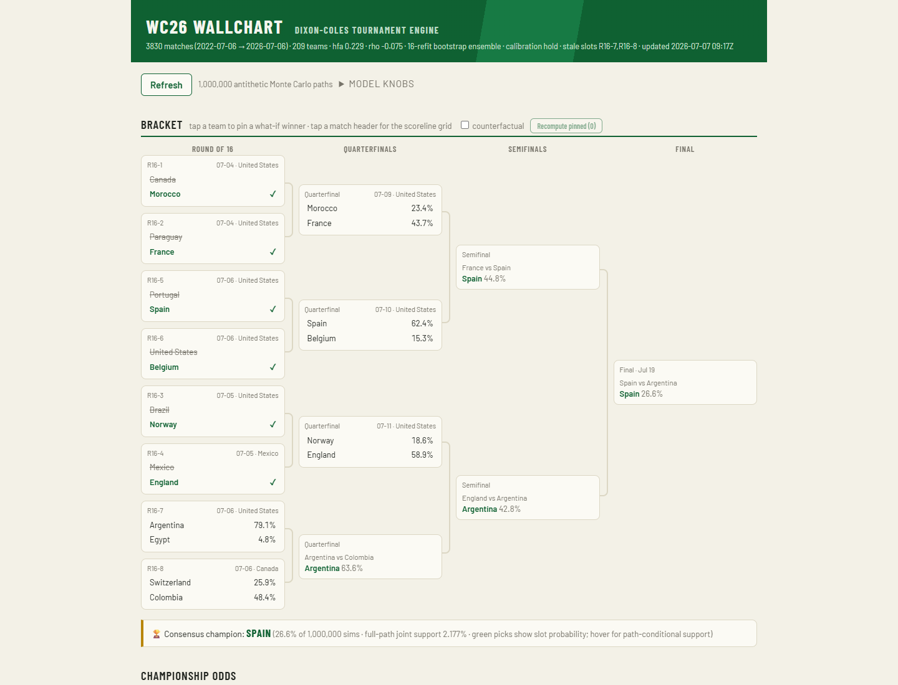
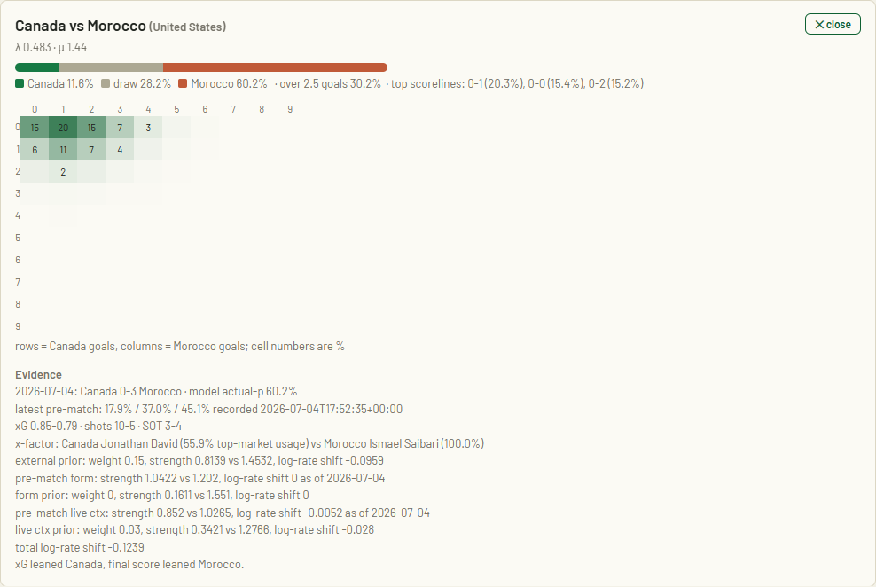
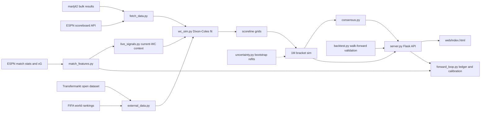

# WC26 Dixon-Coles World Cup Simulator

[](https://www.python.org/)
[](https://github.com/suyashbansal07-dev/FIFA-26-sim/actions/workflows/ci.yml)
[](LICENSE)
[-orange.svg)](http://web.math.ku.dk/~rolf/teaching/thesis/DixonColes.pdf)
[](#model-card)

A self-updating 2026 FIFA World Cup prediction engine. It fits a time-weighted
Dixon-Coles bivariate Poisson model on international results, enriches team
strength with FIFA rankings, player/market/chemistry data, current World Cup
usage, xG/stat momentum, and optional market odds, then runs a vectorized
1,000,000-path knockout simulation behind a small Flask web UI.

The app is mid-tournament by design: played knockout slots are consumed as
facts, remaining slots are forecast from the current bracket state, and every
pre-match forecast is written to a forward ledger for later calibration.

## Screenshots





## Highlights

- Dixon-Coles goal model with exponential time decay, neutral-venue handling,
  host-only home advantage, and low-score tau correction.
- 1,000,000-path bracket Monte Carlo with antithetic, Latin hypercube, Sobol,
  and random samplers.
- Bootstrap parameter ensemble so title odds include model-estimation
  uncertainty instead of only scoreline noise.
- External priors from FIFA rank, Transfermarkt value/depth, caps/goals,
  chemistry, position balance, player availability, and current-WC usage.
- Live context prior from current World Cup result residuals, xG, shots,
  shots on target, corners, and possession.
- Forward-safe evidence loop: pre-match ledger, post-result scoring, reliability
  bins, and sample-gated calibration adjustments.
- Browser UI with definitive verdict bracket, champion probabilities, scoreline
  heatmaps, evidence panels, what-if pins, and counterfactual mode.

## Setup Guide

### Prerequisites

- Python 3.13
- Git
- Network access for live refreshes

### Clone and install

```powershell
git clone https://github.com/suyashbansal07-dev/FIFA-26-sim.git
cd FIFA-26-sim
py -3.13 -m venv .venv
.venv\Scripts\pip install -r requirements.txt
```

Linux/macOS equivalent:

```bash
python3.13 -m venv .venv
. .venv/bin/activate
pip install -r requirements.txt
```

### Optional environment

Copy `.env.example` to `.env` only if you need optional features.

```powershell
Copy-Item .env.example .env
```

- `THE_ODDS_API_KEY`: enables `/api/market` bookmaker-anchor output.
- `WC26_TOKEN`: requires bearer auth for mutating POST endpoints when deployed.

### Build local data artifacts

The app can run from tracked data, but these commands refresh richer model
inputs and validation artifacts:

```powershell
.venv\Scripts\python fifa_rankings.py
.venv\Scripts\python external_data.py
.venv\Scripts\python uncertainty.py --boots 16
.venv\Scripts\python backtest.py
.venv\Scripts\python test_wc_sim.py
```

Generated model data is intentionally ignored under `output/` and most
`data/*.csv`.

### Run the web app

```powershell
.venv\Scripts\python server.py --port 8026 --sims 1000000 --sampler antithetic --auto-refresh-hours 0.25
```

Open <http://127.0.0.1:8026>.

## How To Use

1. Read the bracket: green names are the current forced-pick verdict, and
   unfinished-slot percentages are per-match advance probabilities.
2. Click a match card to inspect the scoreline grid, xG/stat evidence, priors,
   forward forecast, result status, and case notes.
3. Use **Refresh** to scrape latest results, refit, run 1,000,000 paths, and
   append new forward forecasts.
4. Expand **model knobs** for controlled experiments: half-life, friendly
   weight, goal scale, external prior, form prior, live-context prior, sims, and
   sampler.
5. Tap a team in an unfinished slot to pin a what-if winner, then click
   **Recompute pinned**.
6. Enable counterfactual mode only when intentionally rewriting already-played
   slots.

Useful API calls:

```powershell
Invoke-RestMethod http://127.0.0.1:8026/api/data
Invoke-RestMethod "http://127.0.0.1:8026/api/predict?home=Argentina&away=Spain&venue=United%20States"
Invoke-RestMethod "http://127.0.0.1:8026/api/case?home=Canada&away=Morocco&venue=United%20States&date=2026-07-04"
Invoke-RestMethod http://127.0.0.1:8026/api/backtest
```

## Architecture



### Model Card

| Component | Choice | Why |
|---|---|---|
| Goals model | Bivariate Poisson + Dixon-Coles tau correction | low-score dependence |
| Ratings | Team attack, defence, home advantage, rho | compact, proven football scoring model |
| Time decay | Exponential, default half-life 1100 days | recent signal without starving the fit |
| Goal scale | Default 1.10 | reduces low-score overconservatism |
| External prior | Rank, market value, squad depth, chemistry, caps/goals, active star usage, WC usage | richer team-strength signal |
| Form prior | Opponent-adjusted recent form/xG, default weight 0.00 | wired but disabled by default after OOS sweep |
| Live context prior | Current-WC result residuals, xG, and shot pressure, default weight 0.03 | momentum without hard-coded teams |
| Knockout ties | 30-minute Poisson extra time + Beta(5,5)-shrunk shootout rates | better than a coin flip |
| Uncertainty | Bootstrap parameter ensemble | avoids false point-estimate confidence |
| Training pool | FIFA-competition teams only | filters non-FIFA/regional sides |

## Validation

Run:

```powershell
.venv\Scripts\python backtest.py
```

The UI serves the latest `output/backtest.json` with RPS, Brier, log-loss,
favorite reliability bins, in-sample/out-of-sample gap, and scoreline
calibration. The forward loop separately scores only forecasts recorded before
match day, then waits for enough settled samples before tuning priors.

## Web UI & API

| Endpoint | What |
|---|---|
| `GET /api/data` | Full payload: meta, fixtures, verdict, consensus, bracket odds, ratings |
| `GET /api/predict?home=X&away=Y[&venue=C]` | Dixon-Coles card for any matchup |
| `GET /api/case?home=X&away=Y[&venue=C][&date=YYYY-MM-DD]` | Case evidence and diagnostics |
| `GET /api/sample?home=X&away=Y` | Sample one scoreline, including ET and penalties on draws |
| `GET /api/consensus` | Modal champion, slot odds, coherent path, top complete finishes |
| `POST /api/whatif` | Pin winners and re-simulate; `counterfactual=true` rewrites played slots |
| `POST /api/refresh` | Async scrape -> refit -> simulate job with knob overrides |
| `GET /api/status` | Background job status and latest generated timestamp |
| `GET/POST /api/backtest` | Read or recompute walk-forward validation |
| `GET /api/market` | Optional model vs de-vigged bookmaker odds and log-pool blend |

## Project Structure

| File | Role |
|---|---|
| `wc_sim.py` | Fit, scoreline grids, tournament sim, ensemble mixer, verdict bracket |
| `server.py` | Flask API, refresh pipeline, auto-refresh loop |
| `web/index.html` | Single-file vanilla JavaScript UI |
| `fetch_data.py` | martj42 results fetch + ESPN same-day top-up |
| `fifa_rankings.py` | FIFA ranking sync |
| `external_data.py` | Transfermarkt/player/rank/chemistry/WC-usage mart |
| `external_signals.py` | External strength prior |
| `match_features.py` | ESPN match stats and xG ingestion |
| `live_signals.py` | Current-WC xG/stat/result-residual momentum prior |
| `availability.py` | Manual availability adjustments |
| `market_anchor.py` | Optional bookmaker odds anchor |
| `uncertainty.py` | Bootstrap refits |
| `backtest.py` | Walk-forward validation and sweeps |
| `forward_loop.py` | Pre-match forecast ledger and calibration policy |
| `diagnostics.py` | Evidence-first bias and case reports |
| `bracket_2026.json` | Bracket tree, venues, and manual overrides |
| `docs/EVIDENCE_LOG.md` | Bias checks, repairs, and parked decisions |

## Current Limitations

- Forward calibration is sample-gated; it will not auto-tune priors until enough
  pre-match forecasts have settled.
- Public lineups and injuries are not reliable enough for automatic
  missing-starter adjustments yet.
- Exact scoreline shape is monitored separately from aggregate goals; do not
  blindly inflate rates just because many modal scores are 0-0, 1-0, or 1-1.
- Optional market anchoring needs `THE_ODDS_API_KEY`; the core model does not.

## Data & Acknowledgements

- Results: [martj42/international_results](https://github.com/martj42/international_results) (CC0), ESPN public scoreboard API.
- Rankings: [FIFA/Coca-Cola World Rankings](https://www.fifa.com/en/world-rankings).
- Method: Dixon and Coles (1997), *Modelling Association Football Scores and
  Inefficiencies in the Football Betting Market*, JRSS-C 46(2).
- MLE engine: [penaltyblog](https://github.com/martineastwood/penaltyblog).

## License & Disclaimer

[AGPL-3.0](LICENSE). Hosted derivatives must stay open under AGPL terms.
Probabilities are model outputs for education and analysis, not betting advice.
