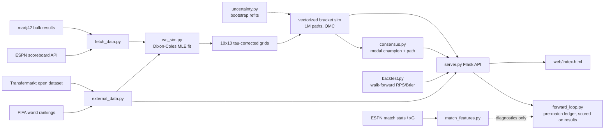

# WC26 — Dixon-Coles World Cup Simulator

[](https://www.python.org/)
[](LICENSE)
[-orange.svg)](http://web.math.ku.dk/~rolf/teaching/thesis/DixonColes.pdf)
[](#simulation-engine)

A statistically rigorous, self-updating prediction engine for the 2026 FIFA World
Cup. Time-weighted Dixon-Coles bivariate Poisson ratings fit on four years of
international results, a vectorized million-path Monte Carlo of the remaining
bracket, honest uncertainty propagation, and a validation loop that scores every
forecast out-of-sample — wrapped in a small Flask web UI.

> Mid-tournament by design: group stage and Round of 32 are consumed as real
> results; the sim starts from the live bracket state and re-calibrates after
> every finished game.

## Highlights

- **Dixon-Coles core** — attack/defence/home-advantage/ρ via penaltyblog's MLE,
  exponential time decay, neutral-venue-aware fitting, host-only home advantage.
- **Million-path bracket sim** — vectorized Monte Carlo with variance-reduction
  samplers (antithetic, Latin hypercube, scrambled Sobol QMC).
- **Parameter-uncertainty ensemble** — bootstrap refits mixed into the sim so
  championship tails reflect estimation error, not false confidence.
- **Consensus bracket** — modal champion plus a coherent champion-anchored path,
  individual slot odds for bracket verdicts, and most frequent complete finishes.
- **Self-updating** — dual scrapers (martj42 bulk + ESPN same-day top-up with
  shootout winners); refresh re-scrapes, refits, and re-simulates in seconds.
- **Evidence discipline** — walk-forward backtest with reliability bins and
  overfit gap, an append-only forward-forecast ledger scored only pre-match
  (no leakage), and a written [evidence log](docs/EVIDENCE_LOG.md).
- **Interactive loops** — what-if winner pinning, tunable half-life / friendly
  weight / goal-scale / sampler knobs, any-matchup predictor with scoreline heatmap.

## Quickstart

```powershell
py -3.13 -m venv .venv                        # penaltyblog ships wheels up to cp313
.venv\Scripts\pip install -r requirements.txt
.venv\Scripts\python server.py                # scrape + fit + simulate, then serve
# open http://127.0.0.1:8026
```

Optional extras:

```powershell
.venv\Scripts\python uncertainty.py --boots 16   # bootstrap ensemble (server auto-uses)
.venv\Scripts\python external_data.py            # player/market/chemistry mart -> model + UI
.venv\Scripts\python backtest.py                 # walk-forward validation -> UI
.venv\Scripts\python backtest.py --sweep         # hyperparameter grid by OOS RPS
.venv\Scripts\python test_wc_sim.py              # self-checks, no framework
```

## Architecture



### Model card

| Component | Choice | Why |
|---|---|---|
| Goals model | Bivariate Poisson + Dixon-Coles τ correction | low-score dependence (0-0/1-0/0-1/1-1) |
| Ratings | attack αᵢ, defence βᵢ per team, global γ (home), ρ | spec §2.1–2.2 |
| Time decay | exponential, half-life 1100 d (sweep-validated) | momentum without starving the fit |
| Goal scale | 1.10 post-fit rate calibration | reduces low-score overconservatism out-of-sample |
| External prior | capped player/market/rank/chemistry rate adjustment, weight 0.12 | richer signal without letting market data dominate |
| Form prior | opponent-adjusted recent-form/xG signal, default weight 0.00 | wired and tunable, but disabled by default after OOS sweep |
| Venue | per-match neutral flag in fit; γ only for hosts at own venue | tournament realism |
| Knockout ties | 30-min Poisson extra time, then Beta(5,5)-shrunk historical shootout rates | principled, not a coin flip |
| Uncertainty | bootstrap parameter ensemble mixed into sim | point MLE is overconfident |
| Training pool | FIFA-competition teams only | dataset carries CONIFA/regional sides via friendlies |

### Validation (latest)

| Metric | Model | Uniform | Train-freq |
|---|---:|---:|---:|
| RPS current calibrated (391 OOS matches, Jan-Jul 2026) | **0.1537** | 0.2360 | 0.2207 |
| Brier current calibrated | 0.4884 | - | - |
| Log-loss current calibrated | 0.8385 | - | - |
| Current calibrated gap | 0.1460 in-sample -> +0.0077 OOS | - | - |

In-sample RPS 0.1460 -> out-of-sample gap +0.0077 (mild, monitored). Reliability
bins and the forward ledger (first settled knockout forecast: Morocco favorite
at 45.1%, hit) live in the UI's *Model validation* section and
[docs/EVIDENCE_LOG.md](docs/EVIDENCE_LOG.md).

## Web UI & API

| Endpoint | What |
|---|---|
| `GET /api/data` | full payload: meta, fixtures + cards, bracket probabilities, consensus, ratings |
| `GET /api/predict?home=X&away=Y[&venue=C]` | Dixon-Coles card for any matchup |
| `GET /api/case?home=X&away=Y[&venue=C][&date=YYYY-MM-DD]` | case evidence: result, xG/stats, forward forecast, external prior |
| `GET /api/sample?home=X&away=Y` | sample one result (ET + pens on draws) |
| `GET /api/consensus` | modal champion, slot odds, coherent path, top complete finishes |
| `POST /api/whatif` | pin R16 winners, re-simulate the bracket |
| `POST /api/refresh` | scrape → refit → re-simulate (accepts knob overrides) |
| `GET/POST /api/backtest` | read / recompute walk-forward validation |

## Project structure

| File | Role |
|---|---|
| `wc_sim.py` | model core: fit, grids, vectorized tournament sim, ensemble mixer |
| `consensus.py` | joint-mode top paths + definitive champion + slot probabilities |
| `uncertainty.py` | bootstrap refits → `output/param_samples.json` |
| `server.py` | Flask API + refresh pipeline + auto-refresh loop |
| `web/index.html` | single-file vanilla-JS UI |
| `fetch_data.py` | scrapers: martj42 bulk + ESPN top-up (shootouts, aliases, UTC skew) |
| `match_features.py` | ESPN match stats / xG ingestion (diagnostics only, forward-safe) |
| `external_data.py` | Transfermarkt player, national-team, market, chemistry, and FIFA-rank mart (ignored output) |
| `external_signals.py` | capped model prior from market, FIFA rank, caps/goals, and chemistry |
| `backtest.py` | walk-forward RPS/Brier/log-loss, reliability bins, `--sweep` |
| `forward_loop.py` | append-only forecast ledger, scored pre-match-only |
| `diagnostics.py` | evidence-first bias reports |
| `bracket_2026.json` | live bracket state (pairings, tree, venues, manual overrides) |
| `docs/EVIDENCE_LOG.md` | every bias found, fix applied, and decision parked |

## Roadmap

- **Market anchor** — closing-odds benchmark + optional log-pool blend (needs an
  odds-API key; parked with rationale in the evidence log).
- **xG-blended ratings** — ingestion already live; blend activates once the
  settled forward sample is large enough to validate a weight.
- **Player/lineup layer** — missing-starter rating adjustments from public squad
  data; only lands with calibration evidence, unlike attribute-sim toys.

## Data & acknowledgements

- Results: [martj42/international_results](https://github.com/martj42/international_results) (CC0), ESPN public scoreboard API.
- Method: Dixon & Coles (1997), *Modelling Association Football Scores and
  Inefficiencies in the Football Betting Market*, JRSS-C 46(2).
- MLE engine: [penaltyblog](https://github.com/martineastwood/penaltyblog).

## License & disclaimer

[AGPL-3.0](LICENSE) — run it, fork it, deploy it; hosted derivatives stay open.
Probabilities are model outputs for education and analysis, **not betting
advice**. The model cannot see injuries, lineups, or tactics (spec §5).
